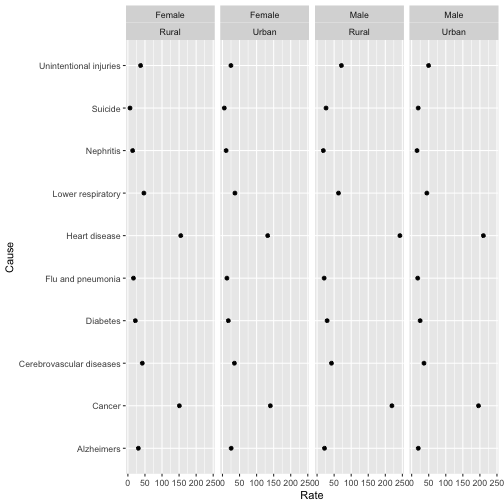

---
title       : "Course Project"
subtitle    : "Slidify presentation with RMarkdown"
author      : "Philippe P. , June 7,2018"
date        : "June 7,2018"
framework   : io2012        # {io2012, html5slides, shower, dzslides, ...}
highlighter : highlight.js  # {highlight.js, prettify, highlight}
hitheme     : tomorrow      # 
widgets     : []            # {mathjax, quiz, bootstrap}
mode        : selfcontained # {standalone, draft}
knit        : slidify::knit2slides
--- .class #id1


## Mortality Rates in US by Cause and Gender

These datasets record mortality rates across all ages in the USA by cause of death, sex, and rural/urban status, 2011–2013.
The average Rate is an Age-adjusted death rate per 100,000 people.
The causes of death are : Alzheimers, Cancer, Cerebrovascular diseases, Diabetes,Flu and pneumonia, Heart disease, Lower respiratory, Nephritis, Suicide, and Unintentional injuries

Here are the data of USMortality, from library UsingR : 


```r
head(USMortality)
```

```
##    Status    Sex         Cause  Rate  SE
## 1   Urban   Male Heart disease 210.2 0.2
## 2   Rural   Male Heart disease 242.7 0.6
## 3   Urban Female Heart disease 132.5 0.2
## 4   Rural Female Heart disease 154.9 0.4
## 53  Urban   Male        Cancer 195.9 0.2
## 54  Rural   Male        Cancer 219.3 0.5
```

--- .class #id2
## Slide with Plot 
### from ggplot2 package


Here is a plot from USmortality dataset.
I used ggplot2 package : 



--- .class #id4 bg:pink
## For more details : Interactive Shiny application


Please click on the link below to open a browser window with my Shiny project.
You need an internet connection as the application is on shinyapps.io

You could therefore interactively modify the graph I plot on the previous slide : 

https://phileytan.shinyapps.io/ShinyCourseProject/
